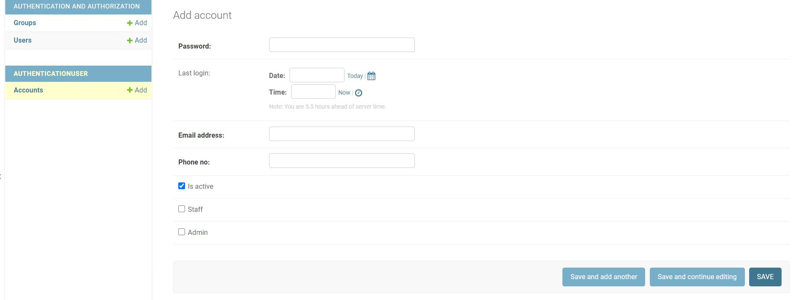
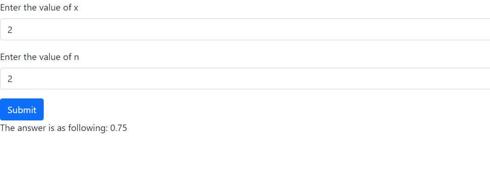

# iraitech_assignment
# Pranjal Goyal

## Output of Question-1
##### For the iterative part, we just needed to iterative over the value till n and sum it, and for the recursive part, I decreased the value of index and call the function with the decreased value

## Output of Question-2
##### The pattern was fairly simple, we can observe that for every even number(n%2==0) the pattern ans was (n*n-1) and for odd number it was (n*n+1)

## Output of Question-3
##### By solving the equation, we get a more simplified version: (x/y)^(a+b)

## Output of Question-4

##### The code uses the AbstractBaseUser, and the model is defined under the authenticationUser app.
##### To check the model, create a superuser, or verify it in Python Shell. 

## Output of Question-5
##### I approached this question by using an APIView of Django-Rest framework, and I created an AJAX request in the index.html page which calls the API and gets the appropiate repsonse back. For the frontend I used Bootstrap.

#### Note: Also In order to access the API you need to createasuperuser since it was mentioned in the requirements.
###### I have only update the README at last..
### Thank You